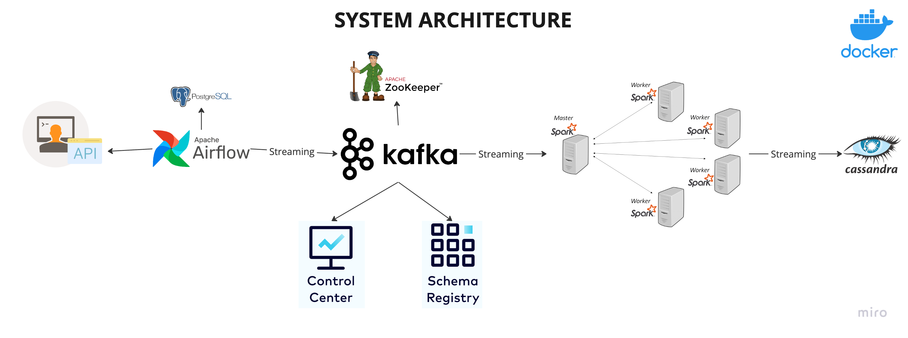

# E2E Realtime Data Streaming Study Project

This is a little pet project based on the tutorial by CodeWithYou: https://www.youtube.com/watch?v=GqAcTrqKcrY

Several moments are changed to my taste. 

Basically, this is a simple data pipeline, the architecture is the following:
 
*The image taken from [the author's repository](https://github.com/airscholar/e2e-data-engineering).*
Airflow is a pseudo-generator of data, querying the randomuser.me API every minute, Kafka is a message broker, there are a very simpler Master-1-Worker Spark Cluster, which streams data into a Cassandra table. The whole setup is dockerized.

### How to run this
The docker setup is rather sloppy.
First, to get the kafka part up, run:

`docker-compose --env-file .env --profile kafka up -d`

If kafka is not created first, airflow will not have anywhere to send events.

Then, to get airflow up:

`docker-compose --env-file .env --profile airflow up -d`

Finally, to get Spark-Cassandra part up: 

`docker-compose --env-file .env --profile kafka up -d`


### What I've changed:
* Airflow DAG runs once a minute and actually ends, now creating an endless loop like in original;
* Spark job is submitted not from outside, but from the node master after initialization. It wasn't done elegantly, alas, here is a comand in the definition of spark master server in docker-compose.yml:
```yaml
    command:
      - /bin/bash
      - -c
      - |
        bin/spark-class org.apache.spark.deploy.master.Master &
        /opt/bitnami/spark/bin/spark-submit \
          --master spark://spark-master:7077 \
          --conf spark.jars.packages=com.datastax.spark:spark-cassandra-connector_2.12:3.4.0,org.apache.spark:spark-sql-kafka-0-10_2.12:3.4.0,org.apache.spark:spark-streaming-kafka-0-10_2.12:3.4.0 \
          --conf spark.jars.repositories=https://repo1.maven.org/maven2/ \
          --conf spark.cassandra.connection.host=broker \
          /opt/spark-apps/spark_stream.py
````
Jar dependencies are also imported there, as no other ways worked for me.

But hey, it just works!